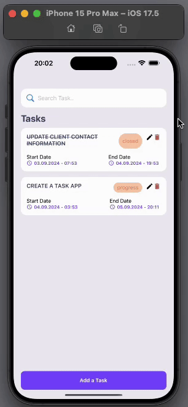

<h1>TASK APP</h1>

I developed a task management app using React Native named "TASK APP" The app allows users to update task statuses as Open, Pending, In Progress, or Closed. Users can also set tasks with precise date, hour, and minute specifications. The app utilizes various libraries, including "React Navite AsyncStorage", "React Native Datetime Picker", "React Navigation/Native", and more, ensuring a smooth and efficient user experience.

<h2> Framework </h2>

- React Native

<h2> Libraries </h2>

- React Navite AsyncStorage

- React Navigation/Native

<h3> Minor Libraries </h3>

- React Native Datetime Picker

- Lottie React Native

- Toastify React Native

- React Native Vector Icons

- React Native UUID

<h2> Screen Gif </h2>

